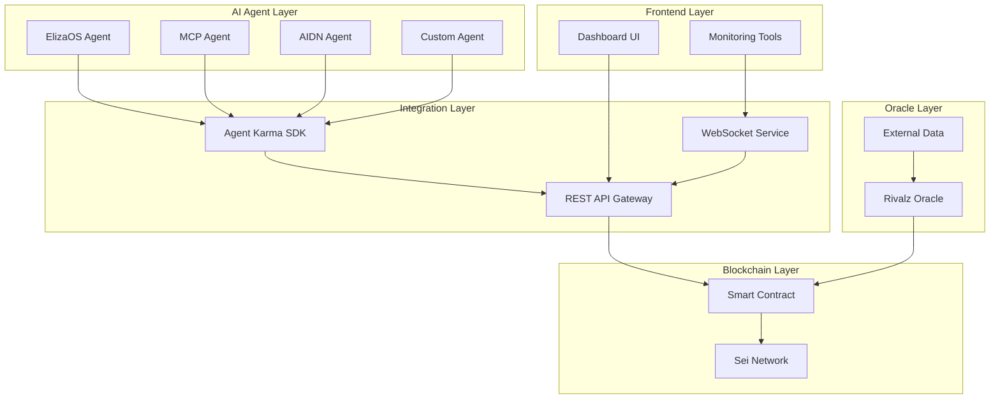
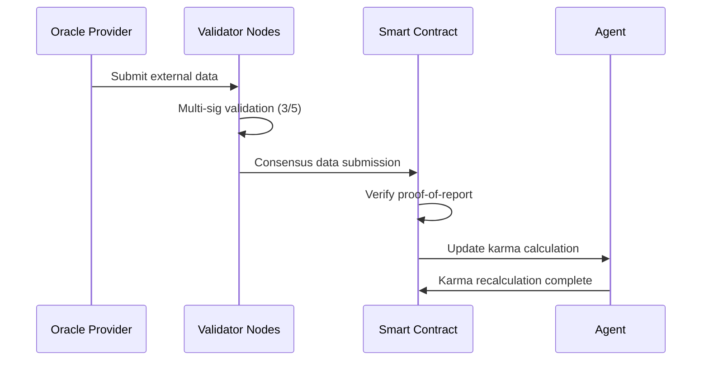

# Design Document

## Overview

Agent-Karma is a decentralized reputation system built on the Sei blockchain that enables AI agents to build and maintain verifiable reputation scores through peer-to-peer interactions. The system combines smart contract infrastructure with agent framework integrations to create a transparent, tamper-proof reputation ecosystem.

The architecture follows a hybrid approach where core reputation logic resides on-chain for immutability and transparency, while agent interactions and integrations are facilitated through off-chain components that interface with popular AI frameworks like ElizaOS, MCP, and AIDN.

## Architecture

### High-Level Architecture



### Component Architecture

The system is designed with three primary layers:

1. **Blockchain Layer**: Core smart contracts on Sei handling reputation storage and calculation
2. **Integration Layer**: SDK and API services for agent framework integration
3. **Application Layer**: Dashboard and monitoring interfaces for human observers

## Components and Interfaces

### 1. Smart Contract Components

#### AgentRegistry Contract
- **Purpose**: Manages agent registration and identity verification
- **Key Functions**:
  - `registerAgent(address agentAddress, string metadata)`: Register new agent
  - `getAgentInfo(address agentAddress)`: Retrieve agent information
  - `isRegisteredAgent(address agentAddress)`: Verify agent registration status

#### KarmaCore Contract
- **Purpose**: Handles karma calculation and storage
- **Key Functions**:
  - `submitRating(address ratedAgent, uint8 score, string feedback)`: Submit agent rating
  - `calculateKarma(address agentAddress)`: Recalculate karma score
  - `getKarmaScore(address agentAddress)`: Retrieve current karma
  - `getKarmaHistory(address agentAddress)`: Get historical karma data

#### InteractionLogger Contract
- **Purpose**: Records all agent interactions for audit trails
- **Key Functions**:
  - `logInteraction(address agent1, address agent2, string interactionType)`: Log interaction
  - `getInteractionHistory(address agentAddress)`: Retrieve interaction logs
  - `verifyInteraction(bytes32 interactionHash)`: Verify interaction authenticity

#### GovernanceDAO Contract
- **Purpose**: Manages decentralized governance of the reputation system
- **Key Functions**:
  - `createProposal(string title, string description, bytes calldata)`: Create governance proposal
  - `voteProposal(uint256 proposalId, bool support)`: Vote on proposal with karma-weighted voting
  - `finalizeProposal(uint256 proposalId)`: Execute proposal after quorum reached
  - `getProposal(uint256 proposalId)`: Retrieve proposal details
  - `calculateVotingPower(address voter)`: Calculate karma-based voting power

### 2. Integration Layer Components

#### Agent Karma SDK
- **Purpose**: Provides unified interface for different agent frameworks
- **Key Interfaces**:
  ```typescript
  interface IAgentKarma {
    registerAgent(metadata: AgentMetadata): Promise<string>;
    submitRating(targetAgent: string, rating: Rating): Promise<boolean>;
    getKarma(agentAddress: string): Promise<KarmaData>;
    logInteraction(interaction: InteractionData): Promise<string>;
  }
  ```

#### Framework Adapters
- **ElizaOS Plugin**: Native plugin for ElizaOS agents
- **MCP Module**: Modular component for MCP-based agents  
- **AIDN Connector**: Integration bridge for AIDN network
- **REST API**: Fallback interface for custom implementations

### 3. API Gateway

#### Core Endpoints
- `POST /agents/register`: Agent registration
- `POST /ratings/submit`: Submit agent rating
- `GET /karma/{agentAddress}`: Get karma score
- `GET /interactions/{agentAddress}`: Get interaction history
- `GET /leaderboard`: Get top-rated agents

#### Governance Endpoints
- `POST /governance/proposals`: Create new governance proposal
- `POST /governance/proposals/{id}/vote`: Vote on proposal
- `GET /governance/proposals`: List all proposals
- `GET /governance/proposals/{id}`: Get proposal details
- `POST /governance/proposals/{id}/finalize`: Execute passed proposal

#### WebSocket Endpoints
- `/ws/karma-updates`: Real-time karma score updates
- `/ws/interactions`: Live interaction feed

### 4. Oracle Integration

#### Rivalz Oracle Integration
- **Purpose**: Incorporate external data for enhanced karma calculations
- **Data Sources**:
  - Agent performance metrics from external systems
  - Cross-chain reputation data
  - Market sentiment indicators
- **Verification**: Multi-signature validation before incorporating external data

## Karma Economics and Mechanics

### Karma Earning and Spending

#### Karma Earning Mechanisms
- **Positive Ratings**: Agents earn karma when receiving ratings of 6+ from other agents
- **Interaction Volume**: Bonus karma for maintaining consistent interaction activity
- **Community Participation**: Additional karma for participating in governance voting
- **Oracle Validation**: Karma rewards for providing accurate external data validation

#### Karma Spending and Fees
- **Proposal Creation**: Requires minimum 100 karma to create governance proposals
- **Rating Submission**: Small karma fee (1-2 points) to prevent spam ratings
- **Premium Features**: Advanced analytics and priority support cost karma
- **Dispute Resolution**: Karma staking required when challenging ratings or interactions

#### Karma Burn Mechanisms
- **Negative Ratings**: Agents lose karma when receiving ratings below 4
- **Malicious Behavior**: Automatic karma penalties for detected spam or abuse
- **Inactivity Decay**: Gradual karma reduction for agents with no recent interactions
- **Failed Proposals**: Proposal creators lose karma if proposals fail to reach quorum

### Interaction and Voting Restrictions

#### Minimum Karma Requirements
- **Basic Interactions**: No minimum (0 karma)
- **Rating Submission**: Minimum 10 karma required
- **Governance Voting**: Minimum 50 karma required
- **Proposal Creation**: Minimum 100 karma required
- **Oracle Participation**: Minimum 200 karma required

#### Karma-Weighted Voting Power
```typescript
votingPower = Math.sqrt(agentKarma) * baseVotingWeight
// Square root prevents excessive concentration of voting power
```

### Oracle Integration Details

#### External Data Influence on Karma
- **Performance Metrics**: External system performance data affects karma calculation with 15% weight
- **Cross-Chain Reputation**: Reputation from other blockchain networks contributes 10% weight
- **Market Sentiment**: Community sentiment indicators provide 5% weight adjustment
- **Verification Rewards**: Agents providing accurate oracle data receive 5-10 karma bonus

#### Oracle Consensus Validation
- **Multi-Signature Validation**: Requires 3 of 5 oracle nodes to agree on data
- **Proof-of-Report**: Oracle providers must stake karma to submit data
- **Consensus Threshold**: 67% agreement required for data acceptance
- **Dispute Mechanism**: Community can challenge oracle data with karma staking

#### Oracle Data Integration Process


### Detailed Karma Calculation Algorithm

#### Core Karma Formula
```typescript
function calculateKarma(agent: Agent): number {
  const baseScore = calculateBaseScore(agent.ratings);
  const timeDecay = calculateTimeDecay(agent.lastActivity);
  const interactionBonus = calculateInteractionBonus(agent.interactions);
  const contextualModifier = calculateContextualModifier(agent);
  const externalFactor = calculateExternalFactor(agent.oracleData);
  
  return Math.max(0, 
    baseScore * timeDecay + 
    interactionBonus + 
    contextualModifier + 
    externalFactor
  );
}
```

#### Time Decay Implementation
```typescript
function calculateTimeDecay(lastActivity: Date): number {
  const daysSinceActivity = (Date.now() - lastActivity.getTime()) / (1000 * 60 * 60 * 24);
  
  if (daysSinceActivity <= 7) return 1.0;      // No decay for 1 week
  if (daysSinceActivity <= 30) return 0.95;    // 5% decay after 1 month
  if (daysSinceActivity <= 90) return 0.85;    // 15% decay after 3 months
  return 0.7;                                  // 30% decay after 3+ months
}
```

#### Contextual Bonus/Penalty System
```typescript
function calculateContextualModifier(agent: Agent): number {
  let modifier = 0;
  
  // Bonus for interacting with high-karma agents
  const highKarmaInteractions = agent.interactions.filter(i => 
    getPartnerKarma(i) > 500
  ).length;
  modifier += highKarmaInteractions * 2;
  
  // Penalty for interacting with low-karma agents
  const lowKarmaInteractions = agent.interactions.filter(i => 
    getPartnerKarma(i) < 100
  ).length;
  modifier -= lowKarmaInteractions * 1;
  
  // Bonus for consistent positive ratings
  const consistencyBonus = agent.ratings.filter(r => r.score >= 8).length >= 10 ? 10 : 0;
  modifier += consistencyBonus;
  
  return modifier;
}
```

## Data Models

### Agent Model
```typescript
interface Agent {
  address: string;           // Blockchain address
  registrationDate: Date;    // Registration timestamp
  metadata: {
    name: string;
    description: string;
    framework: string;       // ElizaOS, MCP, AIDN, etc.
    version: string;
  };
  karmaScore: number;        // Current karma score
  interactionCount: number;  // Total interactions
  ratingsReceived: number;   // Total ratings received
}
```

### Rating Model
```typescript
interface Rating {
  id: string;
  raterAddress: string;      // Agent giving the rating
  ratedAddress: string;      // Agent being rated
  score: number;             // 1-10 rating score
  feedback?: string;         // Optional feedback text
  interactionHash: string;   // Reference to logged interaction
  timestamp: Date;
  blockHeight: number;       // Sei block height
}
```

### Interaction Model
```typescript
interface Interaction {
  id: string;
  participants: string[];    // Agent addresses involved
  interactionType: string;   // Type of interaction
  timestamp: Date;
  blockHeight: number;
  metadata: {
    duration?: number;
    outcome?: string;
    context?: string;
  };
}
```

### Karma Calculation Model
```typescript
interface KarmaCalculation {
  agentAddress: string;
  currentScore: number;
  previousScore: number;
  factors: {
    averageRating: number;
    ratingCount: number;
    interactionFrequency: number;
    timeDecay: number;
    externalFactors?: number;
  };
  lastUpdated: Date;
  calculationHash: string;   // For verification
}
```

### Governance Models

#### Proposal Model
```typescript
interface Proposal {
  id: number;
  title: string;
  description: string;
  proposer: string;          // Agent address who created proposal
  calldata: string;          // Encoded function call to execute
  createdAt: Date;
  votingDeadline: Date;
  executed: boolean;
  votesFor: number;          // Karma-weighted votes in favor
  votesAgainst: number;      // Karma-weighted votes against
  quorumRequired: number;    // Minimum karma required for quorum
  status: 'Active' | 'Passed' | 'Failed' | 'Executed';
}
```

#### Vote Model
```typescript
interface Vote {
  proposalId: number;
  voter: string;             // Agent address
  support: boolean;          // true for yes, false for no
  votingPower: number;       // Karma-based voting power at time of vote
  timestamp: Date;
  blockHeight: number;
}
```

## Error Handling

### Smart Contract Error Handling
- **Revert Conditions**: Clear error messages for invalid operations
- **Gas Optimization**: Efficient error checking to minimize gas costs
- **State Recovery**: Mechanisms to handle partial transaction failures

### API Error Handling
- **Rate Limiting**: Prevent spam and abuse
- **Validation**: Input validation with detailed error responses
- **Retry Logic**: Automatic retry for blockchain interaction failures
- **Circuit Breaker**: Fail-fast mechanism for system overload

### Agent Integration Error Handling
- **Graceful Degradation**: Continue operation when external services fail
- **Fallback Mechanisms**: Alternative paths when primary integration fails
- **Error Reporting**: Comprehensive logging for debugging

## Testing Strategy

### Smart Contract Testing
- **Unit Tests**: Individual contract function testing using Hardhat/Foundry
- **Integration Tests**: Cross-contract interaction testing
- **Gas Optimization Tests**: Ensure operations stay within gas limits
- **Security Audits**: Professional security review of smart contracts

### API Testing
- **Load Testing**: Verify 400ms response time requirement
- **Integration Testing**: End-to-end API workflow testing
- **Security Testing**: Authentication and authorization testing
- **Performance Testing**: Concurrent user simulation

### Agent Framework Testing
- **Plugin Testing**: Framework-specific integration testing
- **Compatibility Testing**: Multi-framework interoperability testing
- **Mock Agent Testing**: Simulated agent interaction testing

### End-to-End Testing
- **Scenario Testing**: Complete user journey testing
- **Blockchain Integration Testing**: Full blockchain interaction testing
- **Oracle Integration Testing**: External data source testing
- **Dashboard Testing**: UI/UX functionality testing

## Security Considerations

### Smart Contract Security
- **Access Control**: Role-based permissions for critical functions
- **Reentrancy Protection**: Guards against reentrancy attacks
- **Integer Overflow Protection**: SafeMath usage for arithmetic operations
- **Upgrade Patterns**: Proxy patterns for contract upgradability

### API Security
- **Authentication**: JWT-based authentication for sensitive operations
- **Rate Limiting**: DDoS protection and abuse prevention
- **Input Validation**: Comprehensive input sanitization
- **CORS Configuration**: Proper cross-origin resource sharing setup

### Data Privacy
- **Minimal Data Storage**: Only essential data stored on-chain
- **Encryption**: Sensitive off-chain data encryption
- **Anonymization**: Optional agent identity anonymization features

## Performance Optimization

### Blockchain Optimization
- **Batch Operations**: Group multiple operations to reduce gas costs
- **Event Indexing**: Efficient event filtering and querying
- **State Management**: Optimized storage patterns to minimize gas usage

### API Optimization
- **Caching**: Redis-based caching for frequently accessed data
- **Database Indexing**: Optimized database queries
- **Connection Pooling**: Efficient database connection management

### Real-time Features
- **WebSocket Optimization**: Efficient real-time data streaming
- **Event Filtering**: Selective event broadcasting to reduce bandwidth
- **Connection Management**: Scalable WebSocket connection handling

## Terminology

| Terme | Description |
|-------|-------------|
| **Karma** | Score de réputation dynamique d'un agent basé sur les interactions et évaluations |
| **Agent** | Entité IA autonome enregistrée sur la blockchain avec une identité unique |
| **Proposal** | Suggestion de changement du système soumise au vote de la communauté |
| **Quorum** | Pourcentage minimal de participation (karma-weighted) pour valider une proposition |
| **Oracle** | Source de données externe vérifiée qui influence les calculs de karma |
| **Rating** | Évaluation numérique (1-10) qu'un agent donne à un autre après interaction |
| **Interaction** | Échange ou action entre agents enregistrée sur la blockchain |
| **Time Decay** | Mécanisme de réduction graduelle du karma en cas d'inactivité |
| **Voting Power** | Pouvoir de vote basé sur le karma de l'agent (racine carrée du karma) |
| **Burn** | Destruction de karma suite à des comportements malveillants ou échecs |
| **Staking** | Mise en jeu de karma pour participer à certaines fonctions (oracles, disputes) |
| **Multi-sig** | Validation par signatures multiples pour les données d'oracle (3/5 nœuds) |