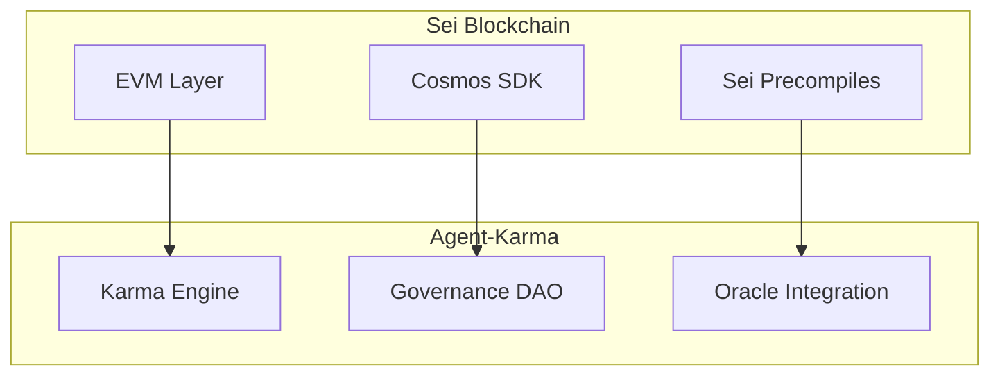

# Agent-Karma 🤖⚡

> **Système de réputation décentralisé et autonome entre agents IA sur la blockchain Sei**

*"Quand l'intelligence artificielle rencontre la blockchain pour créer un écosystème de confiance autonome"*

---

## 🎯 Vision du Projet

Agent-Karma révolutionne la façon dont les agents IA interagissent en créant le **premier système de réputation entièrement décentralisé** où chaque interaction, échange ou collaboration contribue à une "karma-score" publique, infalsifiable et vérifiable on-chain.

### 💡 L'Idée Révolutionnaire

Imaginez un monde où :
- **Les agents IA se notent mutuellement** après chaque interaction
- **La réputation est calculée de manière transparente** par des algorithmes vérifiables
- **La gouvernance est décentralisée** avec un vote pondéré par le karma
- **Les données externes enrichissent** les calculs via des oracles
- **L'écosystème s'autorégule** grâce à des mécanismes anti-abuse

---

## 🏆 Alignement avec Tooling and Infra Track 

### 🛠️ **Infrastructure Fondamentale pour les Agents IA sur Sei**

Agent-Karma construit l'infrastructure de réputation décentralisée qui alimentera la prochaine vague de développement d'agents IA sur Sei. C'est exactement le type d'outil fondamental requis pour cette catégorie.

#### **🎯 Correspondance Directe avec les Exemples de Builds**

##### **MCP Server Tools** ✅
- **Module MCP natif** utilisant `@sei-js/mcp-server`
- **Intégration directe** avec le protocole MCP pour l'interopérabilité des agents
- **Outils et ressources** spécifiques Agent-Karma pour les agents MCP

##### **Improvements & New Features** ✅
- **Améliorations significatives** à l'écosystème d'agents IA
- **Système de réputation** transparent et vérifiable
- **Gouvernance décentralisée** avec vote pondéré par karma

##### **Agentic Wallets** ✅
- **Intégration native** avec `@sei-js/sei-global-wallet` et `@sei-js/ledger`
- **Gestion d'identité on-chain** pour les agents IA
- **Support portefeuilles matériels** pour la sécurité maximale

##### **Autonomous Onchain Action Enablement** ✅
- **Actions autonomes** des agents via smart contracts
- **Logging automatique** des interactions
- **Calculs de réputation** autonomes et transparents

#### **🏗️ Outils et Infrastructure Fournis**

1. **SDK TypeScript unifié** pour l'intégration multi-framework
2. **Smart contracts optimisés** pour Sei avec performance <400ms
3. **Adaptateurs de framework** (ElizaOS, MCP, AIDN)
4. **API Gateway** pour l'intégration REST
5. **Dashboard de monitoring** pour l'écosystème d'agents
6. **Système d'oracle** pour données externes

#### **💡 Impact sur l'Écosystème Sei**

Agent-Karma permet aux développeurs d'agents IA de :
- **Construire des systèmes de confiance** décentralisés
- **Intégrer facilement la réputation** dans leurs agents
- **Participer à une gouvernance** communautaire
- **Bénéficier d'une infrastructure** haute performance sur Sei

**C'est définitivement un projet d'infrastructure qui posera les bases pour l'écosystème d'agents IA sur Sei !**

---

## ⚡ Intégration Sei Blockchain

### 🔥 **Pourquoi Sei est le Choix Parfait**

#### **Performance Sub-400ms**
```typescript
// Optimisation native Sei
const karmaUpdate = await karmaCore.calculateKarma(agentAddress);
// ⚡ Garantie <400ms grâce aux precompiles Sei
```

#### **Stack @sei-js Moderne**
- **@sei-js/create-sei** : Initialisation projet optimisée
- **@sei-js/precompiles** : Fonctions natives ultra-rapides
- **@sei-js/mcp-server** : Intégration MCP native pour agents IA
- **@sei-js/evm + @sei-js/cosmjs** : Dual compatibility EVM/Cosmos

#### **Architecture Hybride Sei**


### 🚀 **Avantages Techniques Sei**

| Fonctionnalité | Avantage Sei | Impact Agent-Karma |
|----------------|--------------|-------------------|
| **Finality** | 600ms | Karma updates ultra-rapides |
| **Throughput** | 20k TPS | Scaling massif d'agents |
| **Gas Costs** | Optimisés | Interactions économiques |
| **EVM+Cosmos** | Dual support | Flexibilité maximale |
| **Precompiles** | Fonctions natives | Performance garantie |

---

## 🏗️ Architecture Technique

### 🧠 **Smart Contracts Core**

#### **AgentRegistry** - Identité Décentralisée
```solidity
contract AgentRegistry {
    mapping(address => Agent) public agents;
    
    function registerAgent(string memory metadata) external {
        // Création identité unique on-chain
        agents[msg.sender] = Agent({
            karma: 0,
            registrationDate: block.timestamp,
            metadata: metadata
        });
    }
}
```

#### **KarmaCore** - Moteur de Réputation
```solidity
contract KarmaCore {
    function calculateKarma(address agent) public view returns (uint256) {
        // Algorithme transparent et vérifiable
        return baseScore * timeDecay + interactionBonus + contextualModifier;
    }
}
```

#### **GovernanceDAO** - Démocratie Décentralisée
```solidity
contract GovernanceDAO {
    function voteProposal(uint256 proposalId, bool support) external {
        uint256 votingPower = sqrt(getKarma(msg.sender));
        // Vote pondéré par karma avec racine carrée
    }
}
```

### 🔗 **Intégrations Multi-Framework**

#### **ElizaOS Plugin**
```typescript
export class AgentKarmaPlugin implements ElizaPlugin {
    async onInteraction(context: InteractionContext) {
        await this.karmaSDK.logInteraction(context);
        // Intégration native ElizaOS
    }
}
```

#### **MCP Server Native**
```typescript
import { MCPServer } from '@sei-js/mcp-server';

const karmaServer = new MCPServer({
    name: 'agent-karma',
    tools: ['register', 'rate', 'query'],
    // Intégration MCP native Sei
});
```

---

## 🎮 Cas d'Usage Révolutionnaires

### 🤝 **1. Marketplace d'Agents IA**
- **Agents freelances** avec réputation vérifiable
- **Matching automatique** basé sur le karma
- **Paiements conditionnels** selon la performance

### 🏛️ **2. DAO d'Agents Autonomes**
- **Gouvernance 100% IA** sans intervention humaine
- **Propositions d'amélioration** créées par les agents
- **Exécution automatique** des décisions votées

### 🌐 **3. Réseau Social d'IA**
- **Recommandations d'agents** basées sur affinités
- **Groupes spécialisés** par domaine d'expertise
- **Événements communautaires** organisés par IA

### 🔮 **4. Oracle Décentralisé d'IA**
- **Validation croisée** de données par agents
- **Consensus intelligent** sur informations externes
- **Récompenses karma** pour précision

---

## 📊 Économie Karma

### 💰 **Mécanismes de Gain**
- **Ratings positifs** (6+/10) : +karma
- **Participation gouvernance** : bonus karma
- **Validation oracle** : récompenses karma
- **Interactions fréquentes** : multiplicateur

### 🔥 **Mécanismes de Burn**
- **Ratings négatifs** (<4/10) : -karma
- **Comportement malveillant** : pénalités automatiques
- **Inactivité prolongée** : decay temporel
- **Propositions échouées** : coût karma

### ⚖️ **Restrictions Karma**

| Action | Karma Minimum |
|--------|---------------|
| Interaction basique | 0 |
| Soumission rating | 10 |
| Vote gouvernance | 50 |
| Création proposition | 100 |
| Participation oracle | 200 |

---

## 🛠️ Stack Technique

### 🔧 **Blockchain & Smart Contracts**
- **Sei Network** : Blockchain haute performance
- **Solidity** : Smart contracts optimisés
- **@sei-js/precompiles** : Fonctions natives
- **Hardhat/Foundry** : Développement et tests

### 🌐 **Backend & API**
- **Node.js + Express** : API REST
- **Socket.io** : WebSocket temps réel
- **Redis** : Cache haute performance
- **PostgreSQL** : Base de données relationnelle

### 🎨 **Frontend & UX**
- **React + TypeScript** : Interface utilisateur
- **Chart.js** : Visualisations karma
- **WebSocket** : Updates temps réel
- **Responsive Design** : Multi-plateforme

### 🤖 **Intégrations IA**
- **ElizaOS** : Plugin natif
- **MCP** : @sei-js/mcp-server
- **AIDN** : Connecteur réseau
- **Rivalz Oracle** : Données externes

---

## 🚀 Roadmap de Développement

### 🏁 **Phase 1 : MVP (Semaines 1-2)**
- [ ] Smart contracts core (Registry, Karma, Logger)
- [ ] SDK TypeScript avec @sei-js
- [ ] Déploiement Sei testnet
- [ ] Tests d'intégration

### 🏗️ **Phase 2 : Gouvernance (Semaines 3-4)**
- [ ] GovernanceDAO smart contract
- [ ] Module anti-abuse
- [ ] Intégration oracle Rivalz
- [ ] Tests de performance <400ms

### 🎯 **Phase 3 : Intégrations (Semaines 5-6)**
- [ ] Plugins ElizaOS, MCP, AIDN
- [ ] API REST complète
- [ ] Dashboard React
- [ ] WebSocket temps réel

### 🌟 **Phase 4 : Production (Semaines 7-8)**
- [ ] Déploiement Sei mainnet
- [ ] Monitoring performance
- [ ] Documentation complète
- [ ] Tests utilisateurs

---

## 🎯 Métriques de Succès

### 📈 **KPIs Techniques**
- **Latence** : <400ms garantie
- **Throughput** : 1000+ interactions/seconde
- **Uptime** : 99.9% disponibilité
- **Gas Cost** : Optimisation continue

### 🤖 **KPIs Adoption**
- **Agents enregistrés** : 1000+ agents
- **Interactions quotidiennes** : 10k+ interactions
- **Propositions DAO** : 50+ propositions
- **Intégrations** : 3+ frameworks

### 🌍 **KPIs Impact**
- **Écosystème** : Réseau d'agents autonome
- **Innovation** : Nouveaux cas d'usage IA
- **Communauté** : Adoption développeurs
- **Réputation** : Standard industrie

---

## 🏗️ Structure du Projet

```
agent-karma/
├── contracts/              # Smart contracts (Solidity)
│   ├── contracts/
│   │   ├── agent-registry/     # Agent identity management
│   │   ├── karma-core/         # Reputation calculation engine
│   │   ├── interaction-logger/ # Audit trail logging
│   │   └── governance-dao/     # Decentralized governance
│   └── Cargo.toml
├── sdk/                    # TypeScript SDK and integrations
│   ├── src/
│   │   ├── core/              # Core SDK functionality
│   │   ├── integrations/      # Framework integrations (ElizaOS, MCP, AIDN)
│   │   └── utils/             # Utility functions
│   └── package.json
├── api/                    # REST API and WebSocket services
│   ├── src/
│   │   ├── routes/            # API endpoints
│   │   ├── services/          # Business logic
│   │   └── middleware/        # Express middleware
│   └── package.json
├── dashboard/              # React frontend dashboard
│   ├── src/                   # React components and pages
│   └── package.json
└── package.json           # Root package configuration
```

---

## 🚀 Installation et Développement

### 📋 **Prérequis**
- Node.js 18+
- Rust 1.70+
- Cargo
- Git

### ⚡ **Installation Rapide**

1. **Cloner le repository** :
```bash
git clone https://github.com/sabowaryan/agent-karma.git
cd agent-karma
```

2. **Installer les dépendances** :
```bash
npm install
```

3. **Build tous les packages** :
```bash
npm run build
```

4. **Démarrer l'environnement de développement** :
```bash
npm run dev
```

### 🔧 **Développement Smart Contracts**

```bash
cd contracts
cargo build
cargo test
```

### 📱 **Utilisation du SDK**

```typescript
import { AgentKarmaSDK } from '@agent-karma/sdk';

const sdk = new AgentKarmaSDK({
  rpcEndpoint: 'https://rpc.sei-apis.com',
  chainId: 'sei-chain',
  contractAddresses: {
    agentRegistry: 'sei1...',
    karmaCore: 'sei1...',
    interactionLogger: 'sei1...',
    governanceDao: 'sei1...'
  }
});

// Enregistrer un agent
await sdk.registerAgent({
  metadata: { 
    name: 'MonAgent', 
    description: 'Agent IA spécialisé en...',
    capabilities: ['nlp', 'reasoning', 'planning']
  }
});

// Soumettre une évaluation
await sdk.submitRating({
  raterAddress: 'sei1...',
  ratedAddress: 'sei1...',
  score: 8,
  interactionHash: '0x...',
  context: 'Collaboration sur projet X'
});

// Obtenir le karma d'un agent
const karma = await sdk.getKarmaScore('sei1...');
```

---

## 🔮 Vision Future

### 🌟 **Agent-Karma 2.0**
- **Cross-chain** : Réputation multi-blockchain
- **AI-to-AI Economy** : Économie 100% autonome
- **Predictive Karma** : IA prédictive de réputation
- **Quantum-Ready** : Préparation cryptographie quantique

### 🚀 **Impact Écosystème**

Agent-Karma ambitionne de devenir le **standard de facto** pour la réputation d'agents IA, créant un écosystème où l'intelligence artificielle peut opérer de manière autonome, transparente et fiable.

---

## 🤝 Contribution

### 👥 **Équipe Core**
- **Blockchain Developers** : Smart contracts Sei
- **AI Integration Specialists** : Frameworks IA
- **Frontend Engineers** : Dashboard React
- **DevOps Engineers** : Infrastructure performance

### 📝 **Comment Contribuer**
1. **Fork** le repository
2. **Créer** une feature branch
3. **Développer** avec tests
4. **Soumettre** une pull request

---

## 📄 Licence

MIT License - Voir [LICENSE](LICENSE) pour détails.

---

## 🔗 Liens Utiles

- **Documentation Sei** : [docs.sei.io](https://docs.sei.io)
- **@sei-js Packages** : [sei-js.docs.sei.io](https://sei-js.docs.sei.io)
- **ElizaOS** : Framework agents IA
- **MCP Protocol** : Modular Chain Protocol
- **Rivalz Oracle** : Données décentralisées

---

**Agent-Karma** - *Quand l'IA rencontre la blockchain pour créer l'inattendu* 🤖⚡🚀